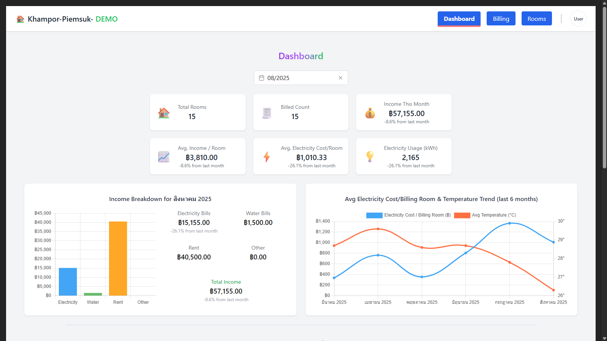
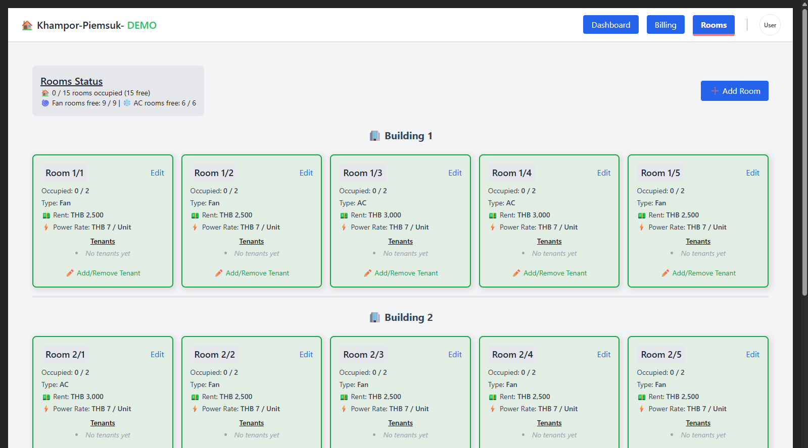
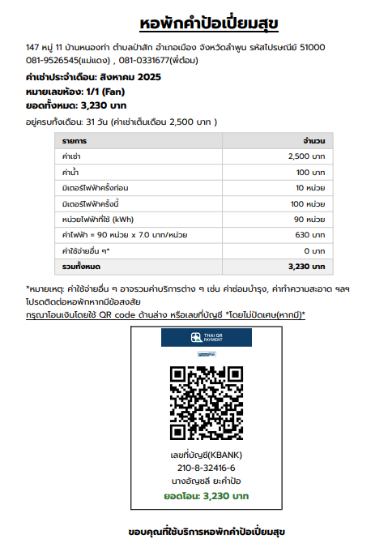

# 🏠 Dormitory Management System

A comprehensive web application for managing dormitory operations, built with modern web technologies. This system streamlines room management, tenant administration, billing processes, and payment collection for dormitory owners and administrators.

## 🚀 Live Demo

Experience the application with guest access - no setup required!

1. **Visit the [Live Demo](https://dorm-app-demo.web.app/login)** 🌐
2. Click **"Login as Guest (Test Access)"** for immediate access
3. Explore all features with admin privileges

_No registration or Firebase setup needed - perfect for recruiters and potential employers to evaluate!_

## 📸 Screenshots

### Dashboard Overview


_Real-time occupancy statistics, revenue tracking, and system overview_

### Room Management


_Visual room status, tenant management, and room operations_

### Billing Example



_Monthly billing statement with automated calculations and PromptPay QR code_

## ✨ Key Features

A comprehensive web application for managing dormitory operations, built with modern web technologies. This system streamlines room management, tenant administration, billing processes, and payment collection for dormitory owners and administrators.

## 🚀 Live Demo

Experience the application with guest access - no setup required!

1. **Visit the [Live Demo](https://dorm-app-demo.web.app/login)** 🌐
2. Click **"Login as Guest (Test Access)"** for immediate access
3. Explore all features with admin privileges

_No registration or Firebase setup needed - perfect for recruiters and potential employers to evaluate!_

## ✨ Key Features

### 🔐 **Authentication & Authorization**

- Multi-provider authentication (Email/Password, Google OAuth)
- Role-based access control (Admin, Staff, Tenant, Guest)
- Secure guest mode for testing and demonstrations

### 🏢 **Room Management**

- Visual room status dashboard with occupancy statistics
- Add, edit, and delete rooms with validation
- Support for different room types (Fan/AC) with automatic pricing
- Duplicate room number prevention
- Tenant assignment and management per room

### 💰 **Billing & Payments**

- Automated monthly billing generation
- Flexible electricity and water billing options
- PDF and image export of billing statements
- Thai PromptPay QR code generation for instant payments
- Billing history and tracking

### 📊 **Dashboard & Analytics**

- Real-time occupancy statistics
- Revenue tracking and visualization
- Room availability by type (Fan/AC)
- Interactive charts and data visualization

### 🎨 **User Experience**

- Responsive design for all devices
- Progressive Web App (PWA) capabilities
- Offline functionality with service worker
- Modern, intuitive interface with Tailwind CSS

## 🛠️ Technical Stack

### **Frontend**

- **Vue.js 3** - Progressive JavaScript framework with Composition API
- **Vue Router** - Client-side routing
- **Pinia** - State management
- **Tailwind CSS** - Utility-first CSS framework
- **Vite** - Modern build tool and development server

### **Backend & Database**

- **Firebase Authentication** - User authentication and authorization
- **Cloud Firestore** - NoSQL document database
- **Firebase Functions** - Serverless backend logic
- **Firebase Hosting** - Static web hosting

### **Additional Technologies**

- **jsPDF** - PDF generation for billing documents
- **Canvas API** - Image generation and manipulation
- **QR Code Generation** - PromptPay payment integration
- **Progressive Web App** - Offline capabilities and app-like experience

## 🏗️ Architecture & Project Structure

```
src/
├── assets/          # Static assets and styles
├── components/      # Reusable Vue components
│   ├── animation/   # Loading and animation components
│   └── *.vue       # Feature-specific components
├── router/          # Vue Router configuration
├── stores/          # Pinia state management
├── utils/           # Utility functions and helpers
├── views/           # Page-level Vue components
├── firebase.js      # Firebase configuration
└── main.js         # Application entry point

functions/           # Firebase Cloud Functions
public/             # Public assets and PWA manifest
```

## 🚀 Getting Started

### Prerequisites

- Node.js (v16 or higher)
- npm or yarn package manager
- Firebase project (optional - guest mode available)

### Quick Start

1. **Clone and install dependencies:**

   ```bash
   git clone https://github.com/ThePonpanit/dormitory-management-demo
   cd dormitory-management-demo
   npm install
   ```

2. **Environment setup:**

   ```bash
   cp .env.example .env
   # Edit .env with your Firebase configuration (optional for guest mode)
   ```

3. **Run development server:**

   ```bash
   npm run dev
   ```

4. **Access the application:**
   - Open http://localhost:5173
   - Click "Login as Guest" for immediate access

### Environment Variables

```env
VITE_FIREBASE_API_KEY=your_firebase_api_key
VITE_FIREBASE_AUTH_DOMAIN=your_project.firebaseapp.com
VITE_FIREBASE_PROJECT_ID=your_project_id
VITE_FIREBASE_STORAGE_BUCKET=your_project.firebasestorage.app
VITE_FIREBASE_MESSAGING_SENDER_ID=your_sender_id
VITE_FIREBASE_APP_ID=your_app_id
VITE_FIREBASE_MEASUREMENT_ID=your_measurement_id
```

## 📱 Features Showcase

### Room Management Dashboard

- **Visual Overview**: Real-time occupancy statistics and room availability
- **Smart Filtering**: View rooms by building, type, or occupancy status
- **Bulk Operations**: Efficient management of multiple rooms

### Automated Billing System

- **Flexible Billing**: Support for different electricity and water billing methods
- **PDF Export**: Professional billing statements with Thai fonts
- **Payment Integration**: PromptPay QR codes for instant payment collection

### User Management

- **Role Assignment**: Granular permission control for different user types
- **Tenant Tracking**: Complete tenant information and room history
- **Authentication Options**: Multiple sign-in methods for user convenience

## 🔧 Development Scripts

```bash
npm run dev          # Start development server
npm run build        # Build for production
npm run preview      # Preview production build
npm run deploy       # Deploy to Firebase Hosting
```

## 🧪 Testing Features

The application includes a comprehensive guest mode for testing:

- **No Setup Required**: Instant access without Firebase configuration
- **Full Admin Access**: Test all features including user management
- **Sample Data**: Pre-populated rooms and billing information
- **Reset Capability**: Clean state for multiple testing sessions

## 🎯 Technical Highlights

### Performance Optimizations

- **Lazy Loading**: Route-based code splitting
- **Image Optimization**: Compressed assets and responsive images
- **Caching Strategy**: Service worker for offline functionality
- **Bundle Analysis**: Optimized build size and load times

### Security Implementation

- **Input Validation**: Client and server-side validation
- **Role-based Authorization**: Secure route protection
- **Environment Variables**: Secure configuration management
- **XSS Protection**: Sanitized user inputs

### Code Quality

- **Component Architecture**: Reusable and maintainable components
- **State Management**: Centralized state with Pinia
- **Error Handling**: Comprehensive error boundaries and user feedback
- **Responsive Design**: Mobile-first approach with Tailwind CSS

## 📈 Future Enhancements

- **Multi-language Support**: Internationalization for Thai and English
- **Advanced Analytics**: Detailed reporting and business intelligence
- **Mobile App**: React Native companion app
- **Integration APIs**: Third-party service integrations
- **Automated Notifications**: Email and SMS alerts for important events

## 🤝 Contributing

This project demonstrates modern web development practices and is open for collaboration. Feel free to:

- Report issues or suggest features
- Submit pull requests for improvements
- Use as a reference for similar projects

## 📄 License

This project is available under the MIT License. See the LICENSE file for more details.

## 👨‍💻 About the Developer

This project showcases expertise in:

- **Frontend Development**: Vue.js, modern JavaScript, responsive design
- **Backend Integration**: Firebase services, serverless architecture
- **Full-Stack Development**: End-to-end application development
- **UI/UX Design**: User-centered design principles
- **Project Management**: Feature planning and implementation

---

**Built with ❤️ by [ThePonpanit](https://github.com/ThePonpanit)**
